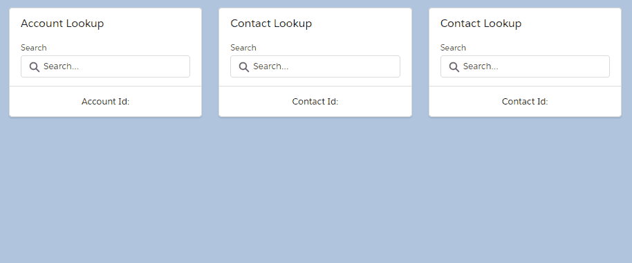

# lwc-lookup

An SObject Generic Lookup component built with LWCs.



## Usage

```html
<template>
  <div class="slds-m-around_large">
    <div class="slds-grid slds-gutters slds-wrap">
      <div class="slds-col slds-size_1-of-3 slds-p-top_medium">
        <lightning-card title="Account Lookup">
          <div class="slds-p-horizontal_medium">
            <c-lookup sobject-name="Account"
              title="Name"
              subtitle="Phone"
              onselected={handleAccountLookup}
              icon-name="standard:account"></c-lookup>
          </div>
          <div slot="footer">
            Account Id: {accountId}
          </div>
        </lightning-card>
      </div>
    </div>
  </div>
</template>

```
```javascript
import { LightningElement, track } from 'lwc'

export default class MyComponent extends LightningElement {
  @track accountId

  handleAccountLookup (event) {
    this.accountId = event.detail
  }
}

```
